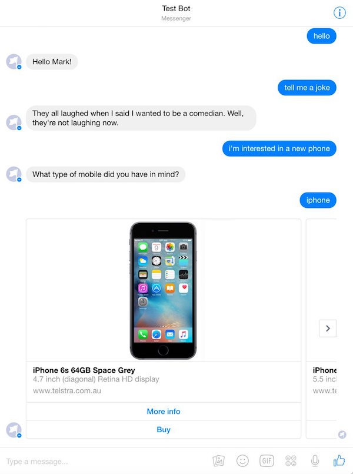

# tombot

A Bot for Facebook Messenger using Scala and Akka-HTTP.

Includes Scala APIs for
* Facebook Messenger
* Skype
* Google NLP
* Google Maps
* Wit.ai

Integrates the following services
* Address Service using [Google Geocoding API](https://developers.google.com/maps/documentation/geocoding/start)
* Alchemy Keywords Service from [IBM Bluemix](http://www.ibm.com/watson/developercloud/alchemy-language.html)
* [Facebook Messenger API](https://developers.facebook.com/docs/messenger-platform)
* [Humour Service](https://github.com/KiaFathi/tambalAPI)
* Intent Parsing Service from [Wit.ai](https://wit.ai/)
* [Google NLP API](https://cloud.google.com/natural-language/docs/)
* [Skype API](https://docs.botframework.com/en-us/skype/getting-started)
* Small-talk API from [Houndify](https://www.houndify.com/)
* Rules Service

### Why Scala and Akka?

* Type-safe integrations with messaging providers

For example,

    val a = event.convertTo[FacebookAccountLinkingEvent]

    val sender = a.sender.id
    val recipient = a.recipient.id
    val status = a.accountLinking.status
    val authCode = a.accountLinking.authorizationCode.get

* Type-safe small DSLs

For example, akka-http routes:

    path("authorize") {
      get {
        parameters("redirect_uri", "account_linking_token") { (redirectURI, accountLinkingToken) =>
          ...
      }
    }

For example, building response cards:

    val payload = (
      loginCard
        usingApi api
        forSender sender
        withText "You need to authorize me"
        withButtonTitle "Connect"
        build()
      )

* Actors using the FSM (finite state machine) DSL to implement conversational state

For example,

    class ConversationActor extends Actor with FSM[State, Data] {

      startWith(Starting, Uninitialized)

      when(Qualifying) {

        case Event(Greet(sender, user), _) =>
          greet(sender, user)
          stay

        case Event(Respond(sender, text), _) =>
          provider.sendHeroCard(sender)
          goto(Buying)
      }

    }

    object ConversationActor extends NamedActor {

      // events
      case class Greet(sender: String, user: User)
      case class Respond(sender: String, text: String)

      sealed trait State
      case object Starting extends State
      case object Qualifying extends State
      case object Buying extends State

    }

* Performance and scalability
* Libraries to support large-scale system design

For example, dependency injection using Google Guice

    class FacebookController @Inject()(config: Config,
                                       logger: LoggingAdapter,
                                       intentService: IntentService) {}

* Functional programming to simplify concurrent system design

Message thread
