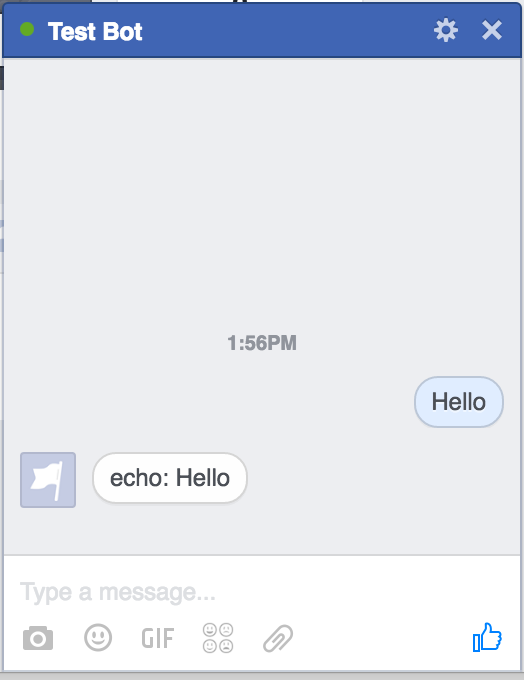
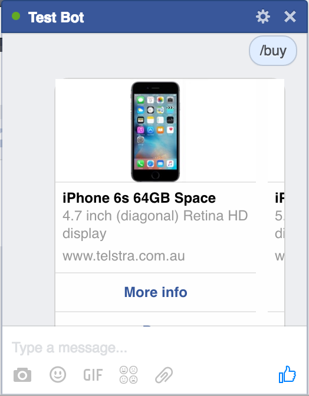
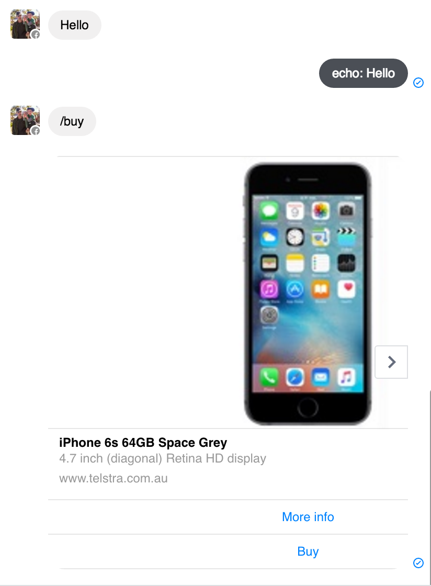

# tombot

A Bot for Facebook Messenger using Scala and Akka-HTTP.

Includes Scala API for Facebook Messenger.

Simple test at this stage. Will echo any message, except when `/buy` slash command is used, which will return a
"Call To Action" (CTA) bubble showing product details and option to buy.

Integrates the following services:
* Address Service using [Google Geocoding API](https://developers.google.com/maps/documentation/geocoding/start)
* Alchemy Keywords Service from [IBM Bluemix](http://www.ibm.com/watson/developercloud/alchemy-language.html)
* [Facebook Messenger API](https://developers.facebook.com/docs/messenger-platform)
* [Humour Service](https://github.com/KiaFathi/tambalAPI)
* Intent Parsing Service from [Wit.ai](https://wit.ai/)
* [Google NLP API](https://cloud.google.com/natural-language/docs/)
* [Skype API](https://docs.botframework.com/en-us/skype/getting-started)
* Small-talk API from [Houndify](https://www.houndify.com/)
* Rules Service

<table width="100%" style="border: none; margin-top: 20px;">
    <tr>
        <td style="border: none;">
            
             
            Echo action
        </td>
        <td style="border: none;">
            
             
            Buy action
        </td>
    </tr>
</table>

Message thread
